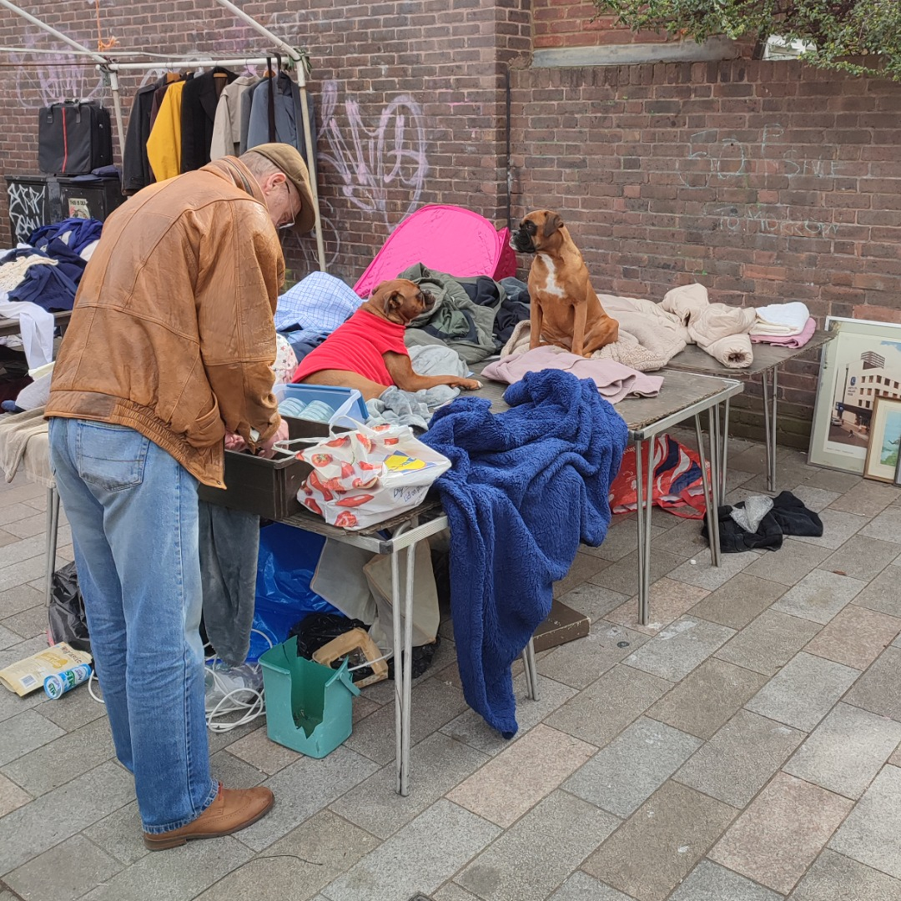

Bringing up a quarter-century of home broadcasts with a culture clash for the ages, South London vs. Essex. The hometowns fought for pride over three "rounds" (if you can call it that). The history books will say that South London blazed Essex quick, the heads will also say this. Somehow Ewen forgot to spin a Sade joint, has to take the L for this reason alone. Enjoy the ting! 

Broadcast live from home in South London, 26th April 2023. Intro clip from [Todd Edwards @ Time & Envy, Romford (2003)](https://youtu.be/1UxY5LonBIc).




